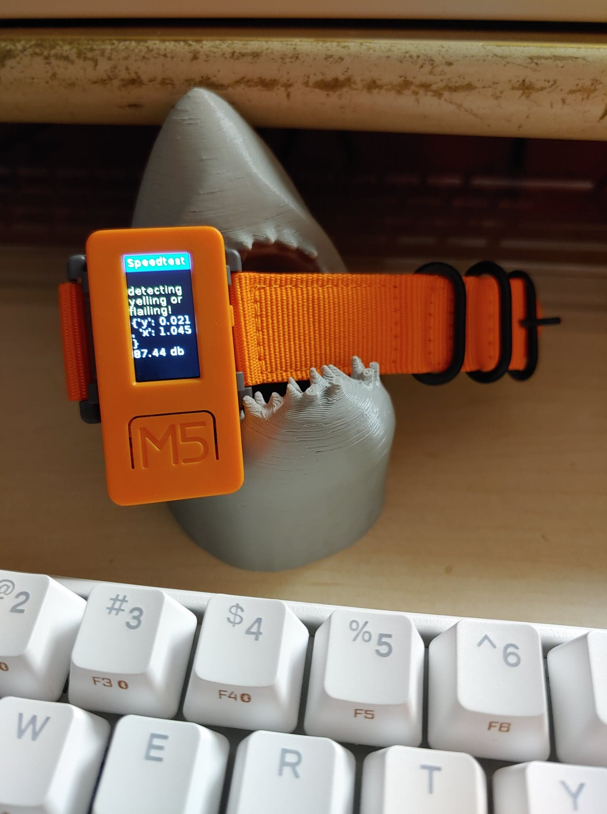
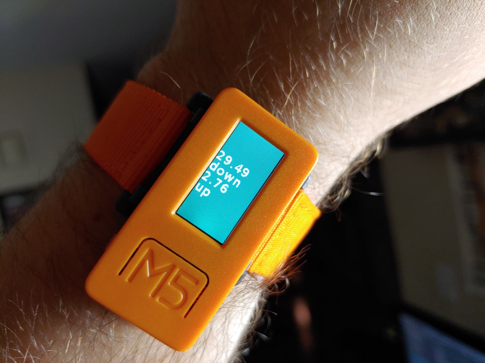

# thrash_internetchecker
M5StickC / Flask implementation

Done for Sony Pictures Imageworks 2020 Fedex Day

https://www.youtube.com/watch?v=Vydo9uNJehM&feature=youtu.be

The idea was to have an HCI-friendly device that could automatically check your internet speed if you were feeling like working home was slow. This would theoretically save thousands in work-from-home equipment getting thrashed if you knew where the error was. 

Since the M5StickC has limited memory, I made a fresh but cached speed from a flask webserver on my network which the watch device could grab from. To trigger the internet speed check, you merely need to move the device a lot or yell at it. However, I encountered a problem grabbing the raw buffer of the microphone in Micropython for M5StickC, so this is implemented in hopes that it will one day work - but if not, you can thrash the device around or press Button B to trigger a speed check.

This could easily also be hooked in to other actions. For example, since our external IPs for Sony are cleared with the company, we could post Panic button hits to a webhook for internal Sony teams to indicate slowness, vs relying on an employee to navigate to a website and register a panic hit separately.

